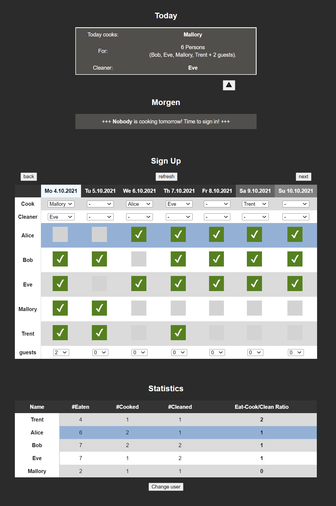
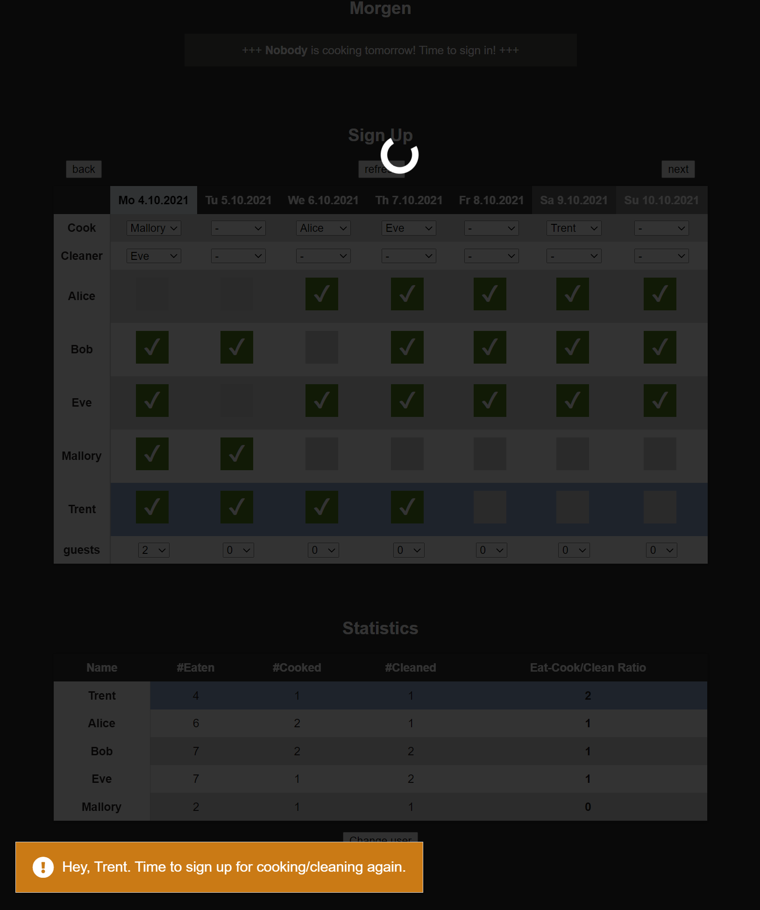

 

  

  <h2 align="center">Lunch Sign Up Plan</h2>

  

    A web app that helped my shared flat a lot to plan who cooks our daily meals.  
    I used no framework just pure javascript, html, css, php and a lightweight sqlite database.  
    It can easily be hosted on a raspberry pi in your local network.
     
    <a href="https://github.com/jkowalk/lunch-sign-in-plan/issues">Report Bug</a>
    ·
    <a href="https://github.com/jkowalk/lunch-sign-in-plan/issues">Request Feature</a>
  

<!-- TABLE OF CONTENTS -->

  
Table of Contents

  <ol>
    <li>
      <a href="#about-the-project">About The Project</a>
      <ul>
        <li><a href="#features">Features</a></li>
      </ul>
    </li>
    <li>
      <a href="#getting-started">Getting Started</a>
      <ul>
        <li><a href="#settings">Settings</a></li>
        <li><a href="#flatastic-cleaning-list">Flatastic Cleaning List</a></li>
      </ul>
    </li>
    <li><a href="#contributing">Contributing</a></li>

  </ol>

 

<!-- ABOUT THE PROJECT -->
## About The Project

I developed this web app out of the need for more organization in our shared flat. We wanted to eat together and one of us should do the cooking. Paper based sign up sheets quickly led to frustration when you were hungry and nobody has cooked. 
The web app is running on a Raspberry Pi in our local wifi and you can check the plan easily from your room. Over the time more and more features have been added. 

## Features
First of all you can sign up to eat, cook or clean after the meal. But there is more:
* __Information dashboard__ on the top with the important information about today and tomorrow.

* __Guests__ can be added to eat, cook or clean with you

* A __statistics__ table shows how fair the work is split

* __Customization__ for every user: Your rows are highlighted, you get personalized notifications.

* __Dietary needs__ can be added and are shown to the cook

* __Admin Panel__ to add/remove users or dietary information (`/admin`)

* For those who also use the <a href="https://www.flatastic-app.com/" target="_blank">Flatastic App</a> you can add display your __cleaning list__ on the page as well

* __Translation__: All Strings are saved in one place and can easily be translated. German and English is already available.

 

Custom Notification            |  Admin Panel                  |  Cleaning List
:-------------------------:|:-------------------------:|:-------------------------:
  |   |   

 

<!-- GETTING STARTED -->
## Getting Started

The app runs in a regular webserver like [Apache](https://httpd.apache.org/). You will need php and sqlite installed. Just clone the repo in the document root.

For Raspberry Pis you can follow [this](https://gndtovcc.home.blog/2020/04/17/how-to-install-phpliteadmin-database-in-a-raspberry-pi/) tutorial (phpLiteAdmin is already in `database/index.php`).

For testing and development I can recomend a docker devcontainer. Check out my [devcontainer config repo](https://github.com/jkowalk/docker-lamp-devcontainer).

### Settings
You can adjust the settings in `src/settings.js` and add language translation in `src/language.js`. In `database/empty_food_db` you can find an empty database clone (it's important that you keep a guest user with id -1)

 

### Flatastic Cleaning List
In order to display your Flatastic cleaning list. You need to set `enable_cleaning_list: true` and set your API key in `flatastic_API_key`. You can find your API key by logging in to your Flatastic Account over the [WebApp](https://www.flatastic-app.com/webapp) and press <kbd>ctrl</kbd><kbd>shift</kbd><kbd>I</kbd> to open the devtools. Under `Application` -> `Local storage` -> `https://app.flatastic-...` you can find the key.

<!-- CONTRIBUTING -->
## Contributing

Feel free to constribute. If you have a suggestion that would make this better, please fork the repo and create a pull request. You can also simply open an issue with the tag "enhancement".
Don't forget to give the project a star! Thanks again!

1. Fork the Project
2. Create your Feature Branch (`git checkout -b feature/AmazingFeature`)
3. Commit your Changes (`git commit -m 'Add some AmazingFeature'`)
4. Push to the Branch (`git push origin feature/AmazingFeature`)
5. Open a Pull Request

(<a href="#top">back to top</a>)
